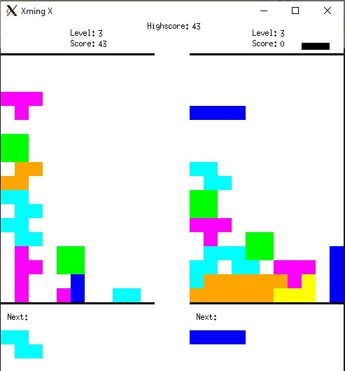
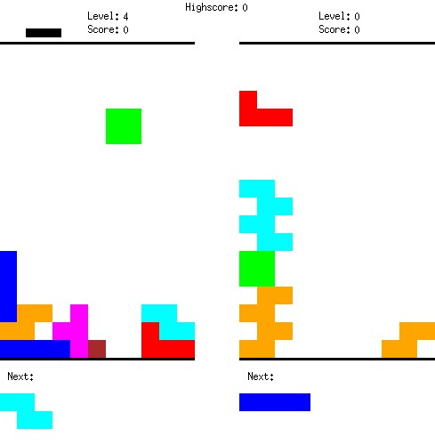

<h1 align="center">🏆 Biquadris 🏆</h1>

Biquadris, is a Latinization of the game <a href="https://en.wikipedia.org/wiki/Tetris">Tetris</a>. In this case, it is expanded for a two player competition as well as allowing the player **unlimited time** to decide where to place a block. A player's turn ends when he/she has dropped a block onto the board. **The game was developped as a part of UWaterloo's <a href="https://student.cs.uwaterloo.ca/~cs246/">CS 246</a> course, which is why the source code is kept secret.**

---
## Development
The main goal for this project was to develop the game using core object oriented principles (in C++), as well as incorporating design patterns. We used multiple design patterns in order to create our game, but the 2 main ones would be the <a href="https://en.wikipedia.org/wiki/Factory_method_pattern">Factory Method Pattern</a> and the <a href="https://en.wikipedia.org/wiki/Observer_pattern">Observer Pattern</a>.

### Factory Method Pattern
The Factory Method Pattern was important to us since we have multiple types of Blocks and Levels such as JBlock, IBlock, LBlock, ... , and Level0, Level1. These were all child classes to the respective classes Block and Level. Once the specification of the child blocks were applied (appearance), they could be dropped, moved right, or left in a very easy and effective manner. The main grid would simply drop a 'Block' type object onto the game board, making our code a lot shorter and more coherent.

### Observer Pattern
To follow the Observer Pattern, each cell within the grid acted as a subject, that contains a list of it's adjacent cells. As a result, whenever a block is dropped or deleted every cell adjacent to it is notified.

---
## Functionality
If you really want to know **ALL** of the functionality, then have a look at 'biquadris.pdf' or click <a href="https://github.com/kushbhag/Biquadris/blob/main/biquadris.pdf">here</a>

### Blocks
Similar to Tetris there are S, Z, L, J, I, T and O blocks

### User Commands
All movement commands are to be input using the keyboard within the terminal. A short list of available commands are seen below
- **left** moves the current block one cell to the left. If this is not possible (left edge of the board, or block in the way), the command has no effect.
- **right** as above, but to the right
- **down** as above, but one cell downward.
- **clockwise** rotates the block 90 degrees clockwise, as described earlier
- **counterclockwise** as above, but counterclockwise.
- **drop** drops the current block as far down as possible. Even if a block is already as far down as it can go (as a result of executing the down command), it still needs to be dropped in order to get the next block
- **levelup** increases the difficulty level of the game by one. The block showing as next still comes next, but subsequent blocks are generated using the new level
- **leveldown** same as above by decreases the difficulty level of the game by one
- **restart** clears the board and starts a new game.

### Scoring
Scoring in biquadris is quite different than what you would see in Tetris. When a line (or multiple lines) is cleared, you score points equal to (your current level, plus number of lines) squared. (For example, clearing a line in level 2 is worth 9 points.) In addition, when a block is completely removed from the screen (i.e., when all of its cells have disappeared) you score points equal to the level you were in when the block was generated, plus one, squared. (For example if you got an O-block while on level 0, and cleared the O-block in level 3, you get 1 point.)

### Levels
There are 5 levels, each of which score different number of points, and provide different challenges.
- Level 0
    - This is the starting level, and is the only level in the game that doesn't have randomness. All of the blocks are predetermined based on a starting file called sequence1.txt and sequence2.txt
- Level 1
    - This is the first level to introduce randomness, but the probabilities are skewed such that S and Z blocks are selected with probability 1/12 each, and the other blocks are selected with probability 1/6 each
- Level 2
    - Each block is selected with the equal probabilty
- Level 3
    - This is the first level where certain challenges start to come forward for the players. In all previous levels, the block would only move down, or drop when the user wanted it to. In this level every block is "heavy" and every command to move or rotate the block will be followed immediately and automatically by a downward move of one row. In addition S and Z blocks are selected with probability 2/9 each, and all other blocks are selected with probability 1/9
- Level 4
    - This is the last level in the game, which incorporates ever rule as seen in Level 3, but ever time you place 5 (and also 10, 15, etc.) blocks without clearing at least one row, a 1x1 block is dropped onto your game board in the centre column. An example of the 1x1 block can be seen below as a maroon block

    
### Special Actions
If a player, upon dropping a block, clears two or more rows simultaneously, a special action is triggered. A special action is a negative influence on the opponent’s game. When a special action is triggered, the game will prompt the player for his/her chosen action. Available actions are as follows:
- **blind** The player’s board, from columns 3-9, and from rows 3-12, is covered with question marks (?), until the player drops a block; then the display reverts to normal
- **heavy** Every time a player moves a block left or right, the block automatically falls by two rows, after the horizontal move
- **force** Change the opponent’s current block to be one of the player’s choosing. If the block cannot be placed in its initial position, the opponent loses.
